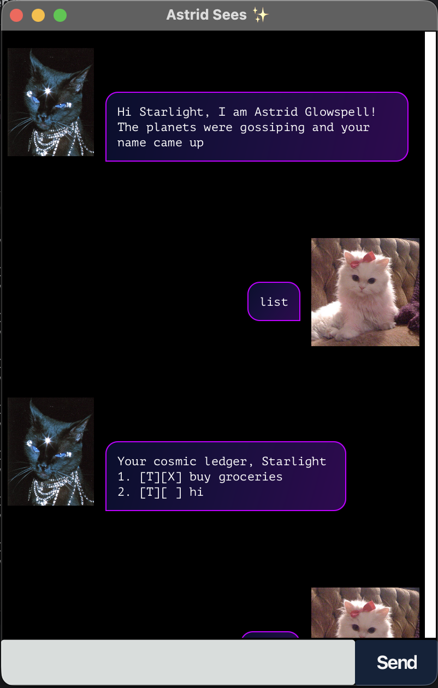

# _Astrid Sees_ User Guide



Astrid is an eccentric task management chatbot who helps you track and manage your tasks in a fun and interactive way. With Astrid, you can easily add, view, and organize your tasks/
## Quick Start

1. Download the latest `astrid.jar` from the [releases page](https://github.com/Duyy0406/ip/releases)
2. Open a terminal/command prompt and navigate to the folder containing `astrid.jar`
3. Run the command: `java -jar astrid.jar`
4. Astrid will greet you with a friendly welcome message
5. Start chatting with Astrid to manage your tasks!

## Features

### Adding a Todo Task: `todo`

Add a simple task to your list.

**Format:** `todo DESCRIPTION`

**Example:**
```
todo Read CS2103T textbook chapter 5
```

**Expected output:**
```
A new intention enters the stars. 
I've added the task:
        [T][ ] Read CS2103T textbook chapter 5
Now you have 1 tasks in your list
```

### Adding a Deadline: `deadline`

Add a task with a specific due date and time.

**Format:** `deadline DESCRIPTION /by DATE TIME`

**Date formats supported:**
- `DD/MM/YYYY HHMM` (e.g., 15/12/2024 2359)

**Example:**
```
deadline Submit project proposal /by 15/12/2025 2359
```

**Expected output:**
```
A fated alignment has been marked. 
I've added the task:
        [D][ ] Submit project proposal (by: Dec 15 2025, 23:59)
Now you have 2 tasks in your list
```

### Adding an Event: `event`

Add a task that spans a specific time period.

**Format:** `event DESCRIPTION /from START_TIME /to END_TIME`

**Example:**
```
event Team meeting /from 25/11/2024 1400 /to 25/11/2024 1600
```

**Expected output:**
```
A comsic event begins and ends in my charts.
I've added the task:
        [E][ ] Team meeting (from: Nov 25 2024, 14:00 to: Nov 25 2024, 16:00)
Now you have 3 tasks in your list
```

### Viewing All Tasks: `list`

Display all tasks in your list.

**Format:** `list`

**Example:**
```
list
```

**Expected output:**
```
Your cosmic ledger, Starlight:
1. [T][ ] Read CS2103T textbook chapter 5
2. [D][ ] Submit project proposal (by: Dec 15 2024, 23:59)
3. [E][ ] Team meeting (from: Nov 25 2024, 14:00 to: Nov 25 2024, 16:00)
```

### Marking Tasks as Done: `mark`

Mark a task as completed.

**Format:** `mark INDEX`

**Example:**
```
mark 1
```

**Expected output:**
```
Destiny fulfilled. Saturn approves.
I've marked this task as done:
      [T][X] Read CS2103T textbook chapter 5
```

### Unmarking Tasks: `unmark`

Mark a completed task as not done.

**Format:** `unmark INDEX`

**Example:**
```
unmark 1
```

**Expected output:**
```
Fate delayed... interesting.
I've marked this task as not done yet:
      [T][ ] Read CS2103T textbook chapter 5
```

### Deleting Tasks: `delete`

Remove a task from your list.

**Format:** `delete INDEX`

**Example:**
```
delete 2
```

**Expected output:**
```
Erased from the cosmic scroll.
I've removed this task
      [D][ ] Submit project proposal (by: Dec 15 2024, 23:59)
Now you have 2 tasks in your list
```

### Finding Tasks: `find`

Search for tasks containing specific keywords.

**Format:** `find KEYWORD`

**Example:**
```
find meeting
```

**Expected output:**
```
The stars revealed this:
1. [E][ ] Team meeting (from: Nov 25 2024, 14:00 to: Nov 25 2024, 16:00)
```

### Seeing reminders: `remind`
View list of tasks due today

**Format:** `remind`

Add a task due today first.

```
deadline Submit quiz /by (Add todays' date here)
deadline Submit quiz /by 19/02/2026 2359
```

**Example:**
```

remind

```

**Expected output:**
```
The moon requests your attention today for:
1. [D][ ] Submit quiz (by: Feb 19 2026 23:59)
```

### Exiting the Application: `bye`

Close Snow and save your tasks.

**Format:** `bye`

## Task Status Symbols

- `[T]` - Todo task
- `[D]` - Deadline task
- `[E]` - Event task
- `[ ]` - Not completed
- `[X]` - Completed

## Data Storage

Snow automatically saves your tasks to a file called `data/AstridGlowspell.txt`. Your tasks will be preserved between sessions, so you don't have to worry about losing your data!

## Tips

1. **Use descriptive task names** - This makes it easier to find tasks later
2. **Set realistic deadlines** - Snow will help you stay organized
3. **Use the find feature** - Quickly locate specific tasks
4. **Add locations** - Keep track of where you need to be
5. **Regular cleanup** - Delete completed tasks that you no longer need to track

## Troubleshooting

**Q: Snow won't start when I double-click the JAR file**  
A: Use the command line instead: `java -jar astrid.jar`. JavaFX applications require specific launch parameters that aren't available when double-clicking.

**Q: Astrid won't start from command line**  
A: Make sure you have Java 11 or later installed on your system. You can check with `java -version`.

**Q: My tasks disappeared**  
A: Check if the `data/AstridGlowspell.txt` file exists in the same folder as the Snow application.

**Q: Date format not recognized**  
A: Use the supported format: `DD/MM/YYYY HHMM`

**Q: Can't find a task**  
A: Use the `find` command with keywords from the task description.

---

*Happy task managing with Astrid! ✨*
